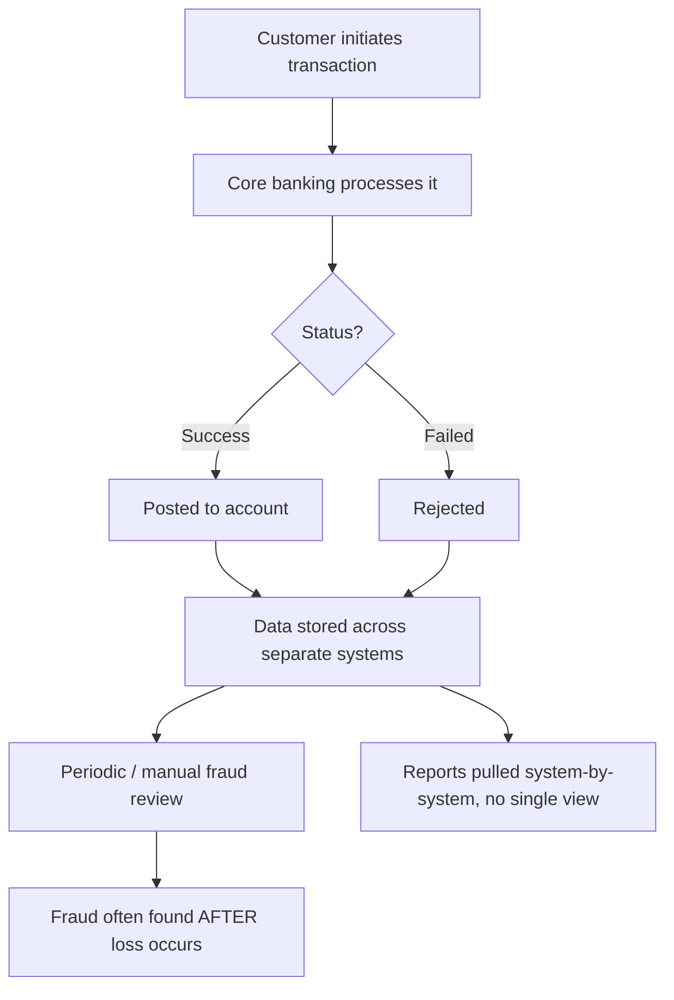

# Business Understanding Document

**Project:** Banking Transaction Monitoring & Fraud Analytics Platform
**Client (fictional):** Meridian Retail Bank
**Phase:** Phase 2 – Business Understanding
**Methodology reference:** CRISP-DM, Phase 1 (Business Understanding)

> This document builds the deep business context for the project. It describes how Meridian operates today, where the pain is, the specific business questions the solution must answer, and how each question becomes something we can measure.

---

## 1. Purpose

Before modelling data or writing rules, we need a shared understanding of the business. This document:

1. Describes the current ("as-is") banking processes relevant to the project.
2. Identifies the pain points the project addresses.
3. Catalogs the exact business questions stakeholders want answered.
4. Translates each business goal into an analytical goal (the CRISP-DM step of turning business objectives into data-analysis objectives).

---

## 2. How the Bank Operates Today (As-Is)

Three business processes matter most for this project.

**A. Customer onboarding.** A person completes KYC (identity verification), a customer record is created, and one or more accounts are opened at a branch. A debit card may be linked. This produces the *customer*, *account*, and *branch* data we later analyse.

**B. Transaction processing.** Every day, customers move money through several channels (ATM, POS, internet, mobile/UPI). Each attempt becomes a transaction with an amount, a channel, and a **status** (success, failed, or reversed). This is the highest-volume, most valuable data in the bank.

**C. Fraud handling (today: reactive).** Currently, suspicious activity is mostly noticed **after** a loss — through customer complaints or periodic manual review. There is no consistent, automated screening as transactions occur.

### As-is process flow

*(This diagram renders visually on GitHub.)*

---

## 3. Pain Points (the "why" behind the project)

| # | Pain point | Business consequence |
|---|---|---|
| P1 | Fraud is caught reactively | Avoidable financial loss and regulatory exposure |
| P2 | Reporting is fragmented across systems | Leadership has no single, trusted view |
| P3 | No consistent definition of key metrics | Different teams report different numbers |
| P4 | Hard to spot inactive/at-risk customers | Silent customer churn |
| P5 | Branch performance is not objectively compared | Poor resource and investment decisions |
| P6 | Transaction failures are not analysed | Operational and revenue leakage goes unnoticed |

---

## 4. To-Be Vision (how the platform helps)

The platform replaces reactive, fragmented working with a single, auditable analytics flow: transactions are streamed and cleaned, screened against explainable fraud rules **as they arrive**, modelled into a reporting-friendly warehouse, and surfaced through consistent KPIs on one dashboard. This directly addresses P1–P6.

---

## 5. Business Question Catalog

This is the heart of the phase: every business question, who asks it, why it matters, the data it needs, and the analytical output that answers it.

| # | Business question | Stakeholder | Why it matters | Data needed | Analytical output |
|---|---|---|---|---|---|
| Q1 | Which branches generate the highest revenue? | Head of Retail | Focus investment on winners | Transactions, branches, revenue | Branch revenue ranking |
| Q2 | Which customers are high-value? | Relationship teams | Target premium offers | Customers, transactions, balances | High-value customer segment |
| Q3 | Which cities generate the most transactions? | Executives | Market/expansion decisions | Transactions, branch city | Transactions by city ranking |
| Q4 | Which customers are becoming inactive? | Relationship teams | Reduce churn | Customers, last transaction date | Inactivity flag per customer |
| Q5 | Which transaction channels are most popular? | Operations | Channel investment | Transactions, channel | Channel usage breakdown |
| Q6 | Which branches have the highest fraud rate? | Fraud lead | Target monitoring effort | Transactions, fraud flags, branch | Fraud % by branch |
| Q7 | Which transaction types are increasing? | Executives | Spot trends early | Transactions, type, date | Trend by transaction type |
| Q8 | Which months have peak transaction volumes? | Operations | Capacity planning | Transactions, date | Monthly volume trend |
| Q9 | Which customers should receive premium offers? | Marketing | Grow high-value base | Customer segmentation, CLV | Target list |
| Q10 | Where are transaction failures highest? | Operations | Fix reliability issues | Transactions, status, channel/city | Failure rate breakdown |

---

## 6. Fraud Scenarios (business view)

These describe fraud as *business situations*. Phase 7 implements them as rules; here we agree on what they mean and why they matter.

| Scenario | What it looks like | Business impact | Signal to detect it |
|---|---|---|---|
| Card testing | Many rapid small transactions | Stolen card being validated | 5+ transactions in 2 minutes; repeated failures then a success |
| Amount anomaly | A charge far above normal | Compromised account | Amount >> customer's average |
| Impossible travel | Two cities in minutes | Cloned card used elsewhere | Distant locations, short time gap |
| Midnight high-value | Large late-night transaction | Unauthorised access | High amount during midnight hours |
| Account takeover | Sudden change in behaviour | Fraudster controls the account | Deviation from usual pattern |

---

## 7. Translating Business Goals into Analytical Goals (CRISP-DM)

| Business goal | Analytical goal (what we actually compute) |
|---|---|
| Understand overall bank health | Aggregate KPIs (revenue, active customers, fraud %, failures) into an executive view |
| Reduce fraud losses | Apply rule-based detection and measure fraud % and alert volume |
| Grow high-value relationships | Segment customers by value/activity and compute simplified CLV |
| Improve reliability | Measure failure rate by channel and city |
| Optimise the branch network | Rank branches by revenue and volume |

---

## 8. How Success Is Measured

Success is defined against the objectives from the BRD:

- Every business question in Section 5 can be answered from the dashboard.
- Fraud scenarios in Section 6 are correctly flagged when present in the data.
- KPIs use the single agreed definitions in the KPI Definition Dictionary (companion document).
- Stakeholders can find their answer without asking a data team to run a one-off query.

---

## 9. Assumptions Specific to This Phase

- "Active" and other windowed metrics use fixed, documented windows (see KPI dictionary).
- Revenue is modelled with a simplified proxy suitable for a portfolio project (finalised during dataset design in Phase 4).
- All personas and data are fictional/synthetic.
