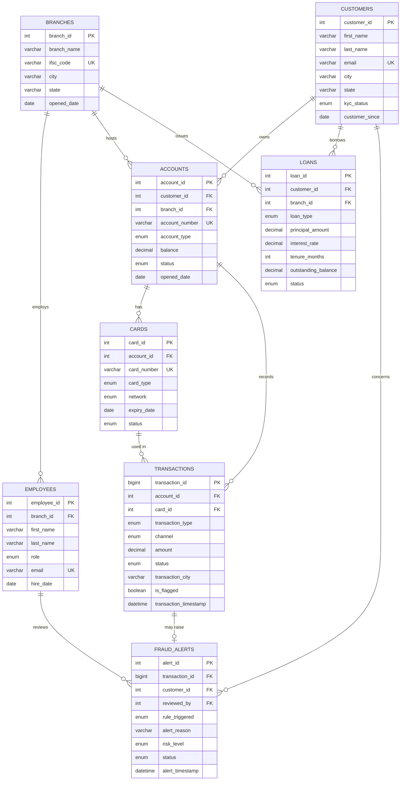

# ER Diagram – OLTP Schema

**Project:** Banking Transaction Monitoring & Fraud Analytics Platform
**Database:** `federal_bank`
**Phase:** Phase 3 – Database Design

> An Entity-Relationship (ER) diagram shows the tables (entities), their key columns, and how they connect. The crow's-foot notation reads as: `||` = "exactly one", `o{` = "zero or many". So `CUSTOMERS ||--o{ ACCOUNTS` means *one customer can have zero or many accounts*. This diagram renders visually on GitHub.

## How to read this design in an interview

- The schema is **normalized to 3NF**: each fact is stored once (a branch's city lives only in `branches`; accounts just reference `branch_id`).
- **Foreign keys** enforce integrity: you cannot record a transaction for an account that doesn't exist.
- The **`transactions`** table is intentionally the busiest, so it uses a `BIGINT` key and targeted indexes for the time-window queries that fraud rules depend on.
- This OLTP design favors **safe, consistent writes**. In Phase 8 we will reshape this data into a **star schema** optimized for fast reporting reads — the classic OLTP-vs-OLAP split.
