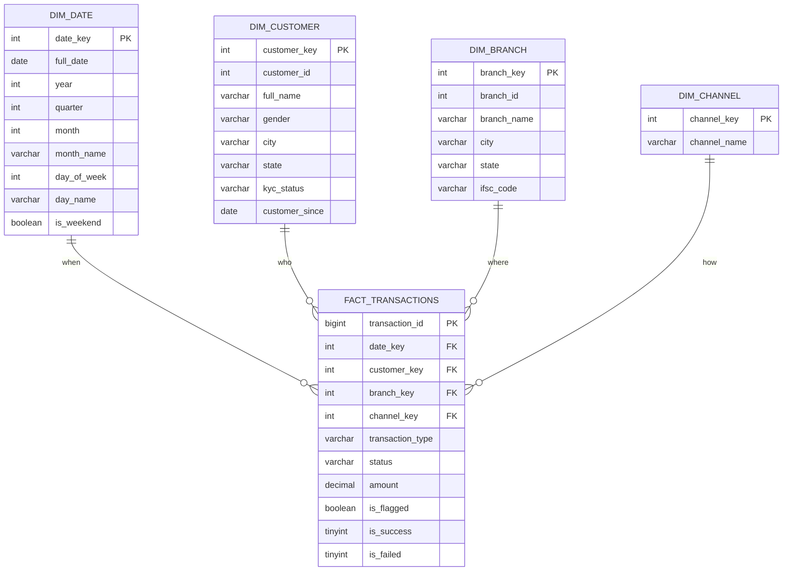

# Star Schema Diagram – Data Warehouse

**Project:** Banking Transaction Monitoring & Fraud Analytics Platform
**Database:** `federal_bank`
**Phase:** Phase 8 – Data Warehouse

> A **star schema** places one central **fact** table (the numbers) in the middle,
> surrounded by **dimension** tables (the descriptive attributes). The shape looks like
> a star. Reporting tools like Power BI are built to consume exactly this shape.

## Fact vs. dimension — the quick mental model
- **Fact** (`fact_transactions`): *measurements*, one row per transaction — the amounts, flags, and counts you aggregate (SUM, COUNT, AVG).
- **Dimensions** (`dim_*`): *context* you slice and filter by — a date, a customer, a branch, a channel.
- A dashboard question is almost always: **"a fact measure, grouped by a dimension attribute"** — e.g., *SUM(amount) by dim_date.month*, or *fraud rate by dim_branch.branch_name*.

## Why this beats querying the OLTP tables directly
1. **Fewer joins.** "Revenue by branch by month" touches the fact plus two dimensions — versus chaining transaction → account → customer → branch on the normalized schema.
2. **A real date dimension.** `dim_date` pre-computes year, quarter, month, weekday and weekend flags, so time-based analysis is a simple `GROUP BY` with no date math.
3. **Surrogate keys.** Each dimension has its own `*_key`, insulating the warehouse from changes to operational ids and following standard warehouse practice.
4. **Power BI ready.** The star shape maps directly onto Power BI's model view, with the fact in the centre and dimensions around it.

## OLTP vs. OLAP (the interview soundbite)
- **OLTP** (Phase 3 schema): optimised for **writes** and integrity — normalized, many small tables. Runs the bank.
- **OLAP** (this star schema): optimised for **reads** and analysis — denormalized into fact + dimensions. Reports on the bank.
- We keep both and load the warehouse *from* the OLTP tables.
